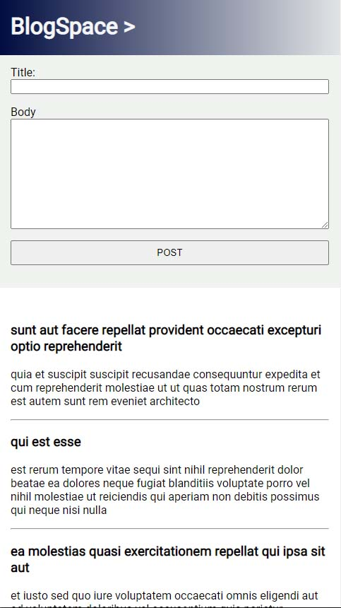

# BlogSpace

BlogSpace is the 2nd project in Module 9 (Working with APIs) of Scrimba's [Frontend Developer Path](https://scrimba.com/learn/frontend). This project makes use of the `fetch` API to get data from an external API, the `.then()` method to chain actions to the response, the `.json()` method to convert response data to JSON and __request methods__ (CRUD operations).

The project uses the __jsonplaceholder API__, which returns 100 responses. The API has no built-in way to limit the number of responses, so we use `.slice()` to take the first 5 response objects from the returned array for use in the app.

Deployed at: https://vish213-blogspace.netlify.app/

